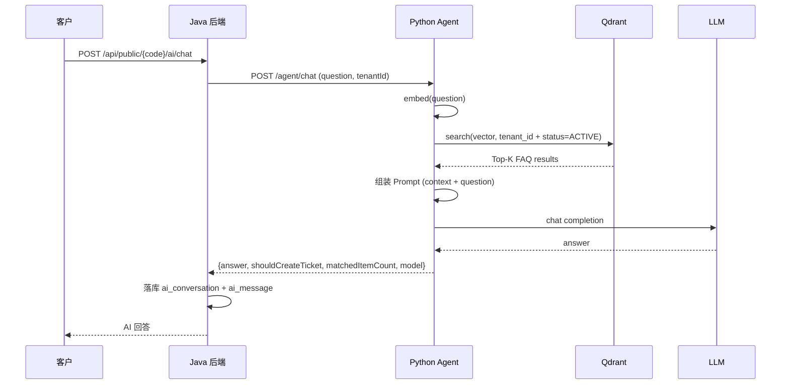
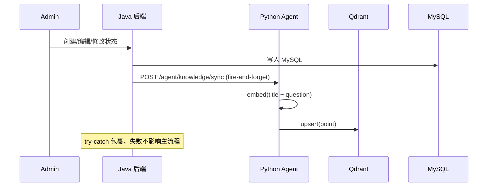
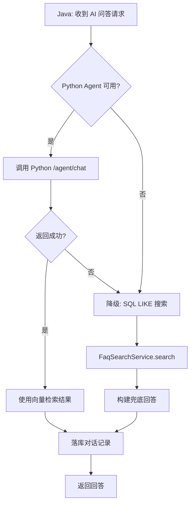

# 系统架构

## 1. 整体架构

```
                        ┌──────────────────────────────────────────────┐
                        │              repair-ai-saas                  │
                        │                                              │
┌───────────┐  HTTP     │  ┌────────────────────────────────────────┐  │
│ 客户 H5   │ ────────▶ │  │         Java 后端 (Spring Boot)        │  │
│ 管理后台  │           │  │  ┌─────────┐ ┌────────┐ ┌───────────┐ │  │
│ 师傅端    │           │  │  │ ticket  │ │customer│ │knowledge  │ │  │
└───────────┘           │  │  │ module  │ │ module │ │  module   │ │  │
                        │  │  └────┬────┘ └───┬────┘ └─────┬─────┘ │  │
                        │  │       │          │            │        │  │
                        │  │  ┌────▼──────────▼────────────▼─────┐ │  │
                        │  │  │        Service 层                 │ │  │
                        │  │  │  tenant_id 过滤 + RBAC + 状态机   │ │  │
                        │  │  └──────────────┬───────────────────┘ │  │
                        │  │                 │                      │  │
                        │  └─────────────────┼──────────────────────┘  │
                        │                    │ HTTP JSON                │
                        │  ┌─────────────────▼──────────────────────┐  │
                        │  │       Python Agent (FastAPI)            │  │
                        │  │  ┌──────────┐  ┌───────────────────┐   │  │
                        │  │  │ Embedding│  │  Qdrant 检索       │   │  │
                        │  │  │ (Mock/   │  │  sync/delete/     │   │  │
                        │  │  │  Live)   │  │  search           │   │  │
                        │  │  └──────────┘  └───────────────────┘   │  │
                        │  │  ┌──────────────────────────────────┐  │  │
                        │  │  │  LLM 调用 (DeepSeek/OpenAI/Mock) │  │  │
                        │  │  └──────────────────────────────────┘  │  │
                        │  └────────────────────────────────────────┘  │
                        │                                              │
                        │  ┌──────────┐ ┌──────────┐ ┌──────────┐    │
                        │  │  MySQL   │ │  Redis   │ │  Qdrant  │    │
                        │  │  业务数据 │ │  缓存    │ │  向量索引 │    │
                        │  └──────────┘ └──────────┘ └──────────┘    │
                        └──────────────────────────────────────────────┘
```

## 2. Java 后端职责

Java 后端是业务主服务，负责所有核心业务逻辑：

| 职责 | 说明 |
|------|------|
| 多租户管理 | 企业注册、租户码生成、`tenant_id` 数据隔离 |
| 认证与鉴权 | JWT 签发/验证、RBAC 角色校验 |
| 客户管理 | 客户 CRUD、手机号自动合并 |
| 工单管理 | 工单 CRUD、状态机流转、状态日志 |
| 知识库管理 | FAQ 知识库和知识条目 CRUD |
| AI 问答路由 | 接收客户问题，调用 Python Agent，落库对话记录 |
| 操作日志 | 关键操作全记录 |
| 降级兜底 | Python 不可用时 SQL LIKE 兜底 |

## 3. Python Agent 职责

Python Agent 专注 AI 相关能力：

| 职责 | 说明 |
|------|------|
| Embedding | 文本转向量（Mock 模式用 SHA-256，Live 模式调 OpenAI API） |
| 向量 CRUD | 知识条目同步到 Qdrant、删除、批量同步 |
| 向量检索 | 按租户 + 产品/故障类型过滤，COSINE 距离排序 |
| LLM 问答 | 基于检索结果组装 Prompt，调用大模型生成回答 |
| Mock 模式 | 无 API Key 时使用规则匹配 + 模板回答，本地演示用 |

## 4. 存储层分工

### MySQL

存储所有业务数据：

- 租户、员工、客户、工单、状态日志
- 知识库、知识条目
- AI 对话、消息记录
- 操作日志

核心特点：所有表含 `tenant_id`，逻辑删除，自动填充时间戳。

### Redis

- 会话缓存
- 可用于限流（V0.3）

### Qdrant

存储 FAQ 向量索引：

- Collection: `repair_faq_items`
- 向量维度：1536（可配置）
- 距离度量：COSINE
- Point payload 携带完整业务字段（tenant_id, title, question, answer, product_type, fault_type, status）
- 搜索时按 `tenant_id + status=ACTIVE` 过滤，可选 `product_type` / `fault_type`

## 5. AI 问答流程



## 6. FAQ 同步向量流程



**删除流程：**
- 禁用状态 → Java 通知 Python 同步（status=INACTIVE），Qdrant 搜索时自动过滤掉
- 删除知识条目 → Java 通知 Python 删除（按 tenant_id + knowledge_item_id filter 删除）

**批量同步：**
- `POST /api/admin/knowledge-items/sync-vectors` 遍历所有 ACTIVE 条目逐个同步

## 7. 多租户隔离设计

### 数据层

```sql
-- 所有业务表结构
CREATE TABLE xxx (
    id BIGINT AUTO_INCREMENT PRIMARY KEY,
    tenant_id BIGINT NOT NULL,  -- 必须字段
    ...
);
```

### 应用层

```
请求 → JwtAuthenticationFilter → 解析 JWT → tenantId 存入 UserContext (ThreadLocal)
     → Controller → Service → 所有查询自动带 tenant_id 条件
```

### 向量层

```
Qdrant 搜索 → filter: must=[tenant_id == X, status == "ACTIVE"]
```

### 隔离保障

- JWT 携带 tenantId，不可伪造
- Service 层强制按 tenantId 过滤
- Qdrant 搜索强制带 tenant_id filter
- 跨租户数据完全不可见

## 8. 降级设计



**降级策略：**

| 场景 | 处理 |
|------|------|
| Python 整体不可用 | AiClient 返回 null → Java 降级 SQL LIKE |
| Qdrant 不可用 | Python search 返回空 → Java 降级 SQL LIKE |
| LLM 不可用 | Python Mock 模式返回模板回答 |
| Embedding 不可用 | Python search 失败 → Java 降级 SQL LIKE |

**关键设计：** `FaqSearchService` 始终保留，不删除。它是最后的兜底。
